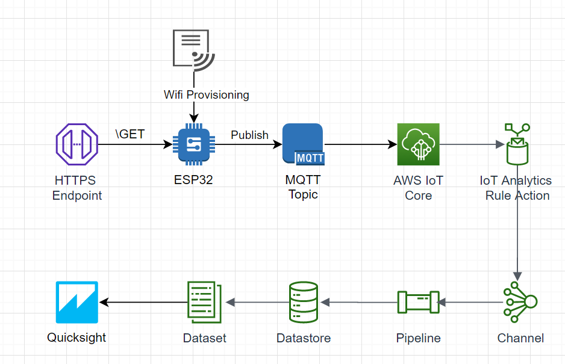

# GetTrafficDataUsingIoT
This projects collects  traffic data of a random Paris street using TomTom REST API on a ESP32 Thing and publish it on AWS IoT to analyse it.

# Work Flow

# Resources Used
1. **TomTom REST API** - To fetch Traffic Data
2. **ESP32DevKitC V4** - To publish data on AWS IoT Core on MQTT protocol
3. **AWS IoT Core** - To receive Traffic data and forward to IoT Analytics
4. **AWS IoT Analytics** - To Anaylse Traffic Data
5. **AWS Quicksight** - To Visualise Traffic Data

# Directories
1. **AWS Resources Policy** :  Contains python boto3 script to deploy required AWS resources
2. **main** : ESP32 Firmware written using ESP-IDF Framework and FreeRTOS.
3. **components** : ESP-IDF components required in this project.
# Visualization of Data on AWS Quicksight

